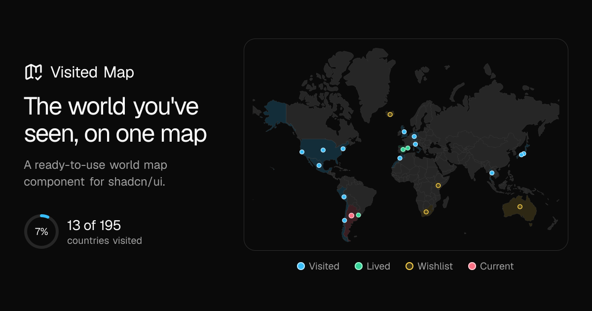

#  Visited Map

An SVG world map for [shadcn/ui](https://ui.shadcn.com) that highlights the countries you've been to, pins cities on top, and counts how much of the world you've seen.

- **No tiles, no API keys.** Country shapes come from [`world-atlas`](https://github.com/topojson/world-atlas) and are projected with [`d3-geo`](https://github.com/d3/d3-geo). Nothing is fetched at runtime.
- **Works in Server Components.** No hooks and no `"use client"`, so the map renders as plain SVG on the server and the map data never reaches the browser. It also works in Client Components and outside the App Router.
- **Follows your theme.** Countries use shadcn tokens (`fill-muted`, `stroke-border`, `bg-card`), so light and dark mode work out of the box.
- **Tooltips without JavaScript.** Country and city names show on hover, click/tap and keyboard focus, using CSS only.

**[Live demo](https://shadcn-visited-map.vercel.app) · [Docs](https://shadcn-visited-map.vercel.app/docs) · [Examples](https://shadcn-visited-map.vercel.app/docs/examples)**



## Installation

```bash
npx shadcn@latest add crashncrow/shadcn-visited-map/visited-map
```

This adds `components/visited-map.tsx` and installs `d3-geo`, `topojson-client` and `world-atlas`. Your project needs shadcn/ui with Tailwind CSS v4 set up (`npx shadcn@latest init`).

<details>
<summary>pnpm, yarn, bun</summary>

```bash
pnpm dlx shadcn@latest add crashncrow/shadcn-visited-map/visited-map
yarn shadcn@latest add crashncrow/shadcn-visited-map/visited-map
bunx --bun shadcn@latest add crashncrow/shadcn-visited-map/visited-map
```

</details>

You can also install from the registry URL:

```bash
npx shadcn@latest add https://shadcn-visited-map.vercel.app/r/visited-map.json
```

## Usage

```tsx
import {
  VisitedMap,
  type VisitedMapCountries,
  type VisitedMapPlace,
} from "@/components/visited-map"

const countries: VisitedMapCountries = {
  current: "AR",
  lived: ["IT"],
  visited: ["BR", "JP", "US"],
  wishlist: ["AU"],
}

// Cities or any other point. coords are [lng, lat], not [lat, lng]
const places: VisitedMapPlace[] = [
  { name: "Barcelona", coords: [2.17, 41.39], country: "ES" },
]

export default function Page() {
  return (
    <VisitedMap countries={countries} places={places} className="max-w-3xl" />
  )
}
```

Each country in `countries` is highlighted with its status color and gets a pin at its center. `places` adds pins anywhere else; a place's `country` is highlighted too. If a country shows up more than once, the strongest status wins: `current` > `lived` > `visited` > `wishlist`. A country's center pin only reflects `countries`, so a `current` city doesn't make its country's pin pulse.

> [!IMPORTANT]
> Place coordinates go in **`[longitude, latitude]`** order (the GeoJSON convention). Google Maps copies them as `lat, lng`, so swap the two numbers.

Rather click than type codes? On the [places page](https://shadcn-visited-map.vercel.app/places) you can mark any of the 195 countries (plus 50 territories such as Curaçao, Puerto Rico or Hong Kong), grouped by continent, add cities by hand (coordinates as copied from Google Maps), preview the map, and copy the generated code.

## Stats

`getVisitedStats` takes the same props as the map and returns the share of the world's countries you've visited (wishlist excluded):

```tsx
import { getVisitedStats } from "@/components/visited-map"

const { visited, total, percent } = getVisitedStats({ countries, places })
// → { visited: 6, total: 195, percent: 3.1 }
```

The total is 195: the 193 UN member states plus the Vatican and Palestine. Small countries that aren't drawn on the map, like Singapore, still count. Territories such as Greenland or Puerto Rico, Kosovo and Taiwan can be highlighted but aren't counted.

## Props

| Prop          | Type                  | Default | Description                                                                                               |
| ------------- | --------------------- | ------- | --------------------------------------------------------------------------------------------------------- |
| `countries`   | `VisitedMapCountries` |         | Countries by status (ISO 3166-1 alpha-2 codes). Each is highlighted with its status color and gets a pin. |
| `places`      | `VisitedMapPlace[]`   |         | Cities or any other point, e.g. Barcelona inside Spain.                                                   |
| `countryPins` | `boolean`             | `true`  | Show a pin at the center of each country in `countries`.                                                  |
| `className`   | `string`              |         | Extra classes for the card container.                                                                     |

### `VisitedMapCountries`

| Field      | Type                      | Description                                            |
| ---------- | ------------------------- | ------------------------------------------------------ |
| `current`  | `VisitedMapCountryCode`   | Where you are now. Its pin pulses.                     |
| `lived`    | `VisitedMapCountryCode[]` | Countries you've lived in.                             |
| `visited`  | `VisitedMapCountryCode[]` | Countries you've been to.                              |
| `wishlist` | `VisitedMapCountryCode[]` | Countries you want to visit. Not counted in the stats. |

### `VisitedMapPlace`

| Field     | Type                                              | Description                                                                            |
| --------- | ------------------------------------------------- | -------------------------------------------------------------------------------------- |
| `name`    | `string`                                          | Shown in the tooltip.                                                                  |
| `coords`  | `[lng, lat]`                                      | Longitude first, then latitude.                                                        |
| `country` | `VisitedMapCountryCode`                           | Country the place is in (e.g. `"ES"`). Highlighted with the place's variant. Optional. |
| `variant` | `"visited" \| "lived" \| "wishlist" \| "current"` | Pin style. Defaults to `"visited"`.                                                    |

### Variants

| Variant    | Pin                                        | Country tint  |
| ---------- | ------------------------------------------ | ------------- |
| `visited`  | Sky blue dot                               | Light sky     |
| `lived`    | Emerald dot                                | Light emerald |
| `wishlist` | Hollow amber dot                           | Light amber   |
| `current`  | Rose dot with a pulsing halo, drawn on top | Light rose    |

The map is drawn at 1:110m, so very small countries (Singapore, Monaco, Malta…) aren't highlighted, but they still get a pin and count in the stats. The 50 territories work too (e.g. `"CW"` for Curaçao, `"PR"`, `"HK"`): they get a pin and are highlighted when drawn, but never count in the stats. Kosovo uses `"XK"`.

To change the colors, edit `pinStyles` and `countryStyles` in `components/visited-map.tsx` after installing. The component is yours to modify.

## Development

This repo is both the docs site and the registry that serves the component.

```bash
npm install
npm run dev             # docs site on http://localhost:3000
npm run registry:build  # regenerates public/r/*.json from registry.json
```

| Path                                   | What it is                                                                                         |
| -------------------------------------- | -------------------------------------------------------------------------------------------------- |
| `registry/visited-map/visited-map.tsx` | The component (source of truth).                                                                   |
| `registry.json`                        | Registry definition read by `shadcn build`.                                                        |
| `public/r/`                            | Built registry JSON served to `shadcn add`. Commit it.                                             |
| `app/page.tsx`                         | Landing page with the demo map.                                                                    |
| `app/(docs)/`                          | Docs (Get Started, API Reference, examples) and the `/places` builder, sharing the sidebar layout. |
| `lib/examples.ts`                      | Example maps and their code, shown under `/docs/examples`.                                         |
| `lib/docs-nav.ts`                      | Top bar, sidebar and search navigation.                                                            |
| `lib/regions.ts`                       | The 195 countries and 50 territories for the `/places` builder.                                    |
| `lib/country-centers.ts`               | Center points of each country and territory (Natural Earth label points).                          |

After changing the component, run `npm run registry:build` and commit the updated `public/r/` so the deployed registry serves the new version.

The short install address (`crashncrow/shadcn-visited-map/visited-map`) reads the registry from this GitHub repo, so changes reach users once they are pushed. It is defined in `lib/site.ts`.

## License

[MIT](LICENSE). The component's country names and centers come from [Natural Earth](https://www.naturalearthdata.com) (public domain). The `/places` page also uses country names and continents from [mledoze/countries](https://github.com/mledoze/countries) ([ODbL](https://opendatacommons.org/licenses/odbl/1-0/)).
